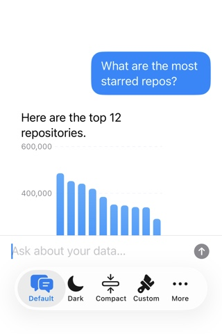
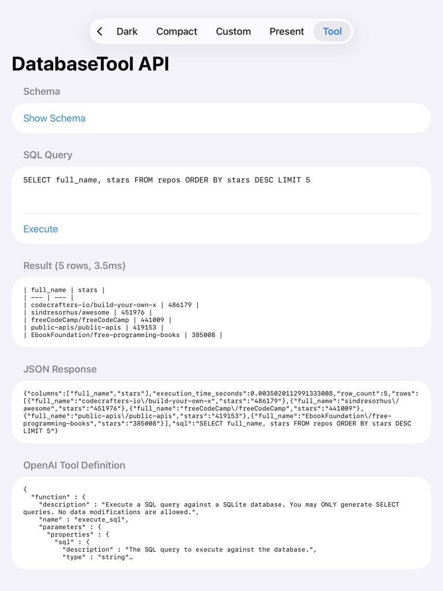

# SwiftDBAI

A Swift package that adds a natural language query interface to any SQLite database in your iOS, macOS, or visionOS app. Works with GRDB, Core Data, SwiftData, or raw SQLite -- any `.sqlite` file on the device.

<!-- badges -->


## Real-World Demo: NetNewsWire

SwiftDBAI added to [NetNewsWire](https://github.com/krishkumar/NetNewsWire) (the open source RSS reader) in one commit. The LLM queries the article database directly -- unread counts, feed rankings, article search. Running Ollama locally, no backend.

| iPhone | iPad |
|---|---|
|  |  |

## Quick Start

Point it at your database, give it an LLM:

```swift
import SwiftDBAI
import AnyLanguageModel

DataChatView(
    databasePath: documentsURL.appendingPathComponent("app.db").path,
    model: OllamaLanguageModel(model: "qwen3-coder")
)
```

Or pass an existing GRDB connection:

```swift
DataChatView(
    database: myDatabasePool,
    model: OpenAILanguageModel(apiKey: key, model: "gpt-4o"),
    allowlist: .readOnly,
    additionalContext: "E-commerce app with orders, products, and customers."
)
```

Schema introspection is automatic. No annotations, no mapping files. Read-only by default.

## Tool Calling

If your app already talks to an LLM, use `DatabaseTool` to register SwiftDBAI as a tool it can call. Your existing LLM generates SQL, SwiftDBAI validates and executes it.

```swift
let tool = try await DatabaseTool(databasePath: myDB)

// Add schema to your system prompt
let systemPrompt = "You are a helpful assistant.\n\n" + tool.systemPromptSnippet

// Register with your LLM
let functionDef = tool.openAIFunctionDefinition

// When the LLM calls the tool
let result = try tool.execute(sql: "SELECT * FROM users WHERE active = 1")
result.jsonString     // return to LLM as tool response
result.markdownTable  // display to user
```

SQL is validated against a read-only allowlist before execution. INSERT, UPDATE, DELETE, and DROP are rejected.



## Headless / Programmatic Use

Use `ChatEngine` directly when you don't need a UI:

```swift
let pool = try DatabasePool(path: myDB)
let engine = ChatEngine(
    database: pool,
    model: OpenAILanguageModel(apiKey: key, model: "gpt-4o")
)

let response = try await engine.send("How many users signed up this week?")
print(response.summary)   // "There were 42 new signups this week."
print(response.sql)        // Optional("SELECT COUNT(*) FROM users WHERE ...")
```

## Installation

```swift
dependencies: [
    .package(url: "https://github.com/krishkumar/SwiftDBAI.git", from: "1.0.0"),
]
```

## Presentation

Works in every context: sheets, full-screen covers, navigation pushes, UIKit modals.

| Custom theme | Sheet presentation |
|---|---|
|  |  |

```swift
// Sheet with nav bar and Done button
.dataChatSheet(isPresented: $showChat, databasePath: path, model: myLLM)

// Full-screen cover
.dataChatFullScreen(isPresented: $showChat, databasePath: path, model: myLLM)

// UIKit
let vc = DataChatViewController(databasePath: path, model: myLLM)
present(vc, animated: true)
```

See [THEMING.md](THEMING.md) for customization -- colors, fonts, dark mode, compact mode, assistant avatars.

## Features

- Drop-in SwiftUI chat view (`DataChatView`) or headless `ChatEngine`
- LLM-agnostic via [AnyLanguageModel](https://github.com/huggingface/AnyLanguageModel) -- OpenAI, Anthropic, Gemini, Ollama, llama.cpp, or any OpenAI-compatible endpoint
- `DatabaseTool` for integrating into your existing LLM tool calling setup
- Automatic schema introspection -- no manual annotations
- Safety-first: read-only by default, operation allowlists, table-level mutation policies
- Auto-generated bar charts, pie charts, and data tables
- Structured output via `@Generable` for models that support it
- 448 tests

## Choosing a Provider

```swift
// Cloud
ProviderConfiguration.openAI(apiKey: "sk-...", model: "gpt-4o")
ProviderConfiguration.anthropic(apiKey: "sk-ant-...", model: "claude-sonnet-4-20250514")

// Local -- data stays on device
ProviderConfiguration.ollama(model: "llama3.2")
ProviderConfiguration.llamaCpp(model: "default")

// Any OpenAI-compatible endpoint
ProviderConfiguration.openAICompatible(apiKey: "key", model: "llama-3.1-70b", baseURL: url)
```

## Safety

| Preset | Allowed |
|---|---|
| `.readOnly` (default) | SELECT |
| `.standard` | SELECT, INSERT, UPDATE |
| `.unrestricted` | SELECT, INSERT, UPDATE, DELETE |

Per-table control via `MutationPolicy`. Destructive operations require confirmation through `ToolExecutionDelegate`.

## Architecture

```
User Question
    |
    v
ChatEngine
    |-- SchemaIntrospector   (auto-discovers tables, columns, keys, indexes)
    |-- PromptBuilder        (builds LLM system prompt with schema context)
    |-- LanguageModel        (generates SQL via AnyLanguageModel)
    |-- SQLQueryParser       (parses and validates against allowlist/policy)
    |-- GRDB                 (executes SQL against SQLite)
    |-- TextSummaryRenderer  (summarizes results via LLM)
    v
ChatResponse { summary, sql, queryResult }
```

## Demo App

The demo app is at `Example/SwiftDBAIDemo/`. It includes a showcase of all themes and presentation modes. Generate the Xcode project with [xcodegen](https://github.com/yonaskolb/XcodeGen):

```
cd Example/SwiftDBAIDemo && xcodegen generate
```

## Requirements

- iOS 17.0+ / macOS 14.0+ / visionOS 1.0+
- Swift 6.1+
- Xcode 16+

## License

MIT. See [LICENSE](LICENSE) for details.
