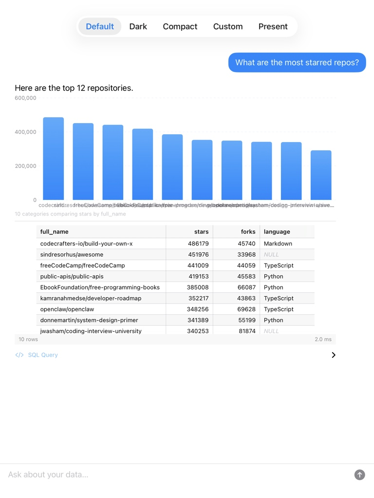
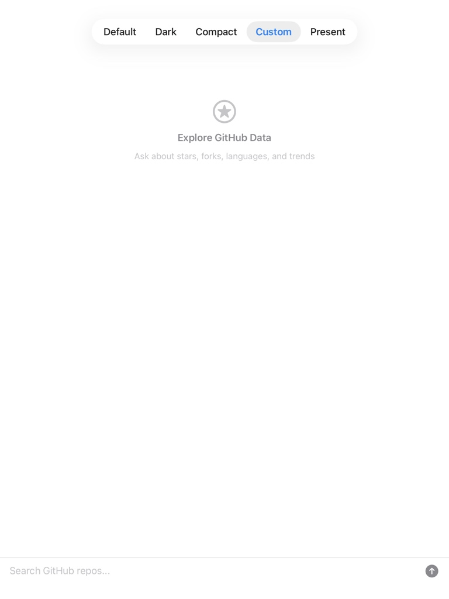
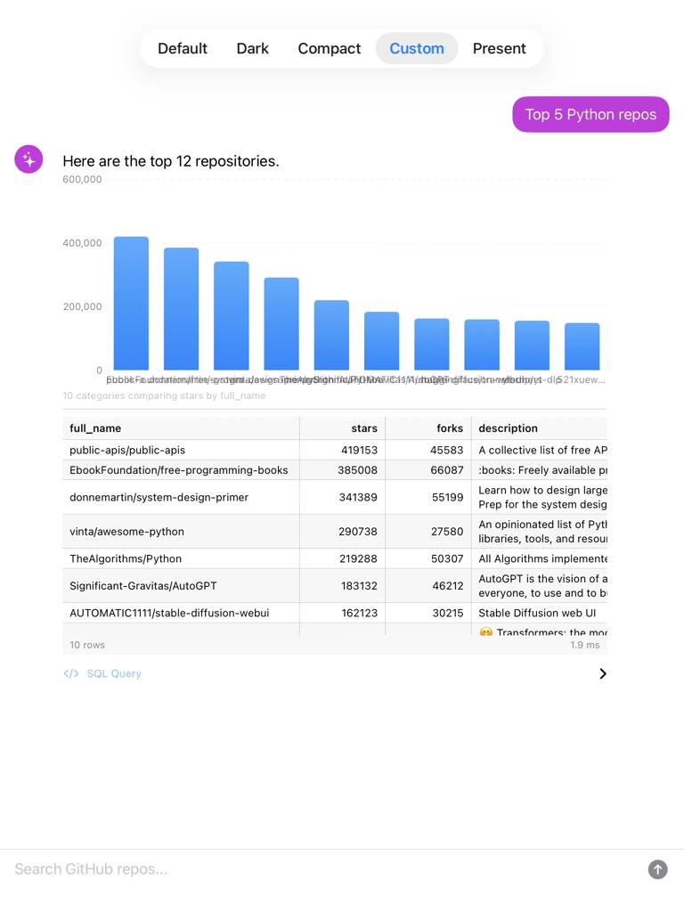
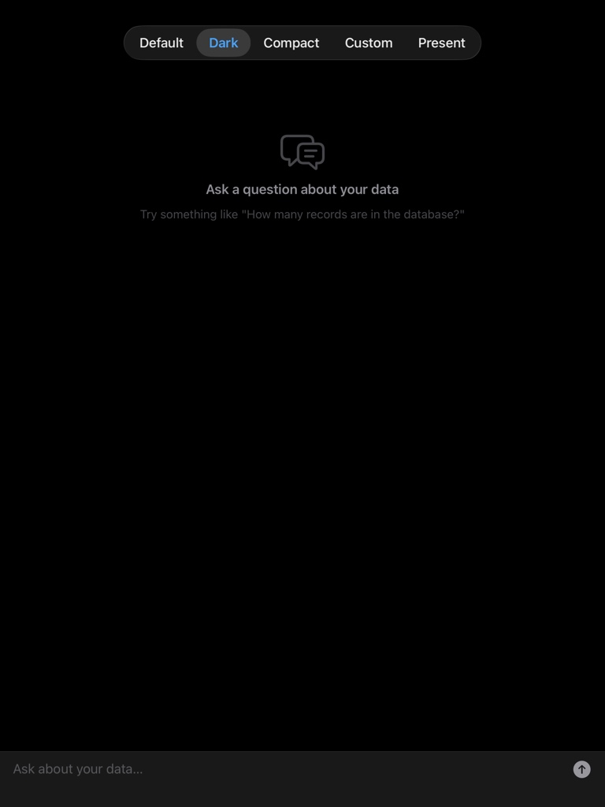
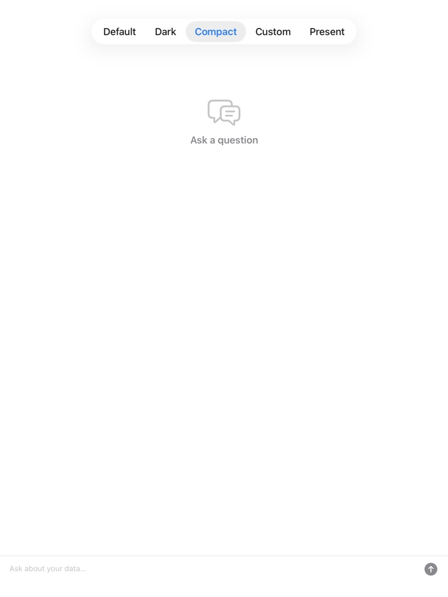
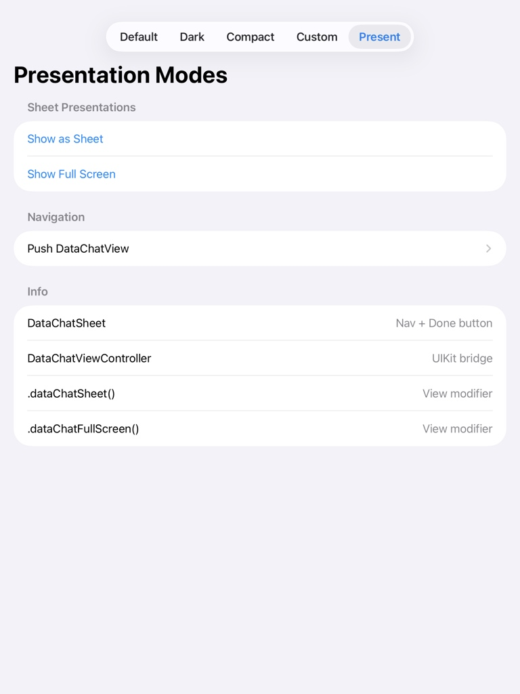
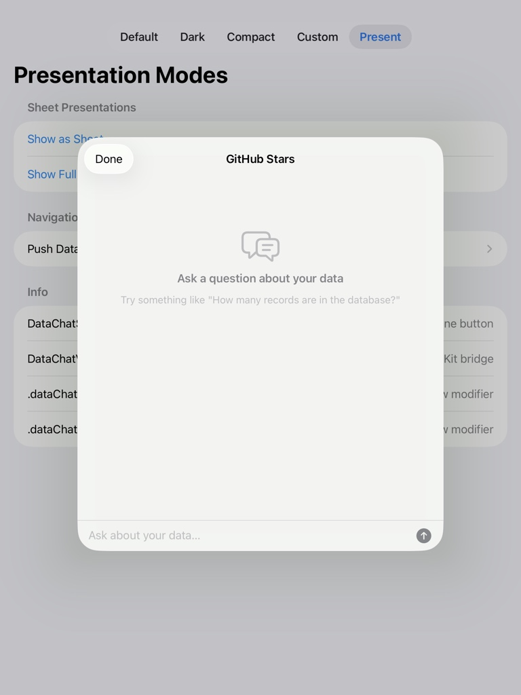

# SwiftDBAI Screenshots

## Query Results

Bar chart and data table from a natural language query against a GitHub stars database.



## Customization

### Custom Theme

Purple accent, custom placeholder ("Search GitHub repos..."), custom empty state icon and text.

```swift
var config = ChatViewConfiguration.default
config.userBubbleColor = .purple
config.accentColor = .purple
config.inputPlaceholder = "Search GitHub repos..."
config.emptyStateTitle = "Explore GitHub Data"
config.emptyStateIcon = "star.circle"

DataChatView(databasePath: path, model: myLLM)
    .chatViewConfiguration(config)
```

| Empty state | With results |
|---|---|
|  |  |

### Dark Theme

```swift
DataChatView(databasePath: path, model: myLLM)
    .chatViewConfiguration(.dark)
```



### Compact Theme

```swift
DataChatView(databasePath: path, model: myLLM)
    .chatViewConfiguration(.compact)
```



## Presentation Modes



### Sheet

```swift
.sheet(isPresented: $showChat) {
    DataChatSheet(databasePath: path, model: myLLM, title: "GitHub Stars")
}
```


